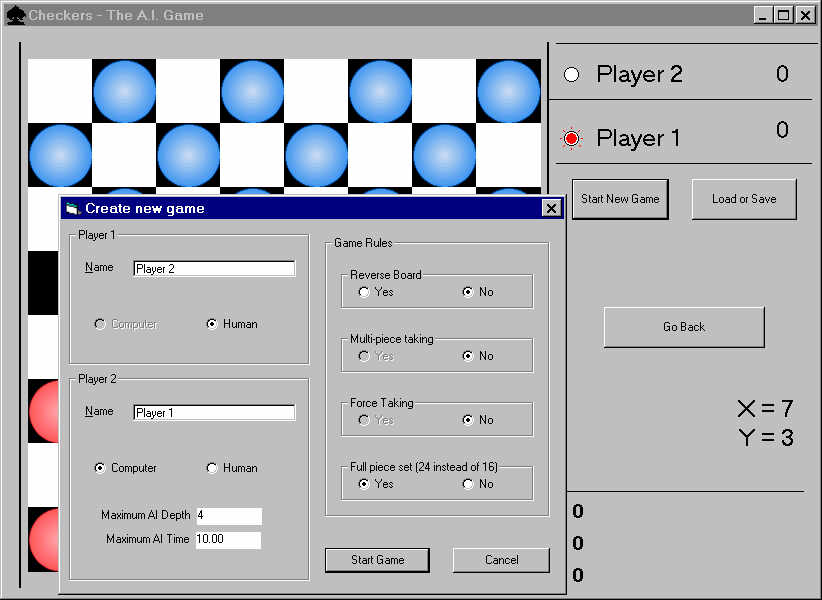



## AI Checkers \(VB\)

### Description

A checkers board game simulation with working 2 player (2 humans) and 1 player (1 human vs PC) modes. The code is not complete but most of the functions are finished and it should be workable. It uses a minimax depth first search procedure runs (to a search depth of 5-6) to decide what move to do (AI only) the rules are adjustable but some are not yet completely implemented. Expect updates quite regularly - if you can make any changes please email them to me.
 
### More Info
 

             |
---                |---
**Submitted On**   |2000-06-03 23:20:46
**By**             |[Daniel George](https://github.com/Planet-Source-Code/PSCIndex/blob/master/ByAuthor/daniel-george.md)
**Level**          |Intermediate
**User Rating**    |5.0 (10 globes from 2 users)
**Compatibility**  |VB 4\.0 \(32\-bit\), VB 5\.0, VB 6\.0
**Category**       |[Games](https://github.com/Planet-Source-Code/PSCIndex/blob/master/ByCategory/games__1-38.md)
**World**          |[Visual Basic](https://github.com/Planet-Source-Code/PSCIndex/blob/master/ByWorld/visual-basic.md)
**Archive File**   |[CODE\_UPLOAD6400632000\.zip](https://github.com/Planet-Source-Code/daniel-george-ai-checkers-vb__1-8383/archive/master.zip)

